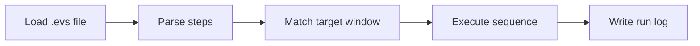

# evade-script-engine

*A standalone Evade Script runtime for Windows users who need predictable, low-friction execution — no build tools, no dependency chasing.*

## What this is

**evade-script-engine** is a lightweight execution engine built around Evade Script, a scripting format used to automate repetitive in-app and in-game sequences without touching source code. The engine reads a script file, resolves its instructions against the target window, and runs the sequence step by step — nothing more, nothing hidden.

This repository hosts the source and release notes. It does not host the compiled binary directly; the current build is distributed through the project's landing page, where you can verify the version, read the changelog, and download the installer that matches your Windows edition.

  

The button opens the project's landing page, where the current build is available for download.

## Who it is for

- **Automation testers** who need repeatable input sequences without writing a full test harness.
- **QA engineers** validating UI flows across app builds on Windows.
- **Script authors** who already write Evade Script and want a stable runtime, not a full IDE.
- **Power users** automating routine, multi-step desktop tasks.
- **Small teams** standardizing a shared script library across machines.

## What you can do

- **Run `.evs` script files** directly, without a compiler or interpreter setup.
- **Queue multiple scripts** in sequence with configurable delays between them.
- **Target specific windows** by title or process, so scripts stay scoped.
- **Log every executed step** to a local file for later review.
- **Pause and resume** a running script mid-sequence with a hotkey.
- **Reload a script on save** to speed up iteration while editing.
- **Set execution speed** independently from the script's recorded timing.
- **Export a run summary** listing steps completed, skipped, and failed.

## Getting started

1. Open the landing page using the button above.
2. Download the current Windows build listed there.
3. Extract the archive to any folder — no installer wizard required.
4. Launch `evade-script-engine.exe`.
5. Load an `.evs` file and press **Run**.

## Requirements

- Windows 10 or Windows 11 (64-bit).
- No .NET, Python, or Node toolchain — the build is standalone.
- Roughly 40 MB of free disk space.
- Administrator rights only if the target application also runs elevated.

## How it works

1. The engine parses the `.evs` script into a step list.
2. Each step is matched against the target window handle.
3. Steps execute in order, respecting recorded or overridden timing.
4. Results are written to the run log.
5. On completion, the engine idles until the next script is loaded.

## Keyboard shortcuts

| Shortcut | Action |
|---|---|
| `F5` | Run the loaded script |
| `F6` | Pause / resume execution |
| `F7` | Stop execution immediately |
| `Ctrl+O` | Open a script file |
| `Ctrl+R` | Reload the current script |
| `Ctrl+L` | Open the run log folder |
| `Ctrl+Shift+D` | Toggle debug step view |
| `Esc` | Cancel a pending action |

## FAQ

**What is Evade Script used for?**
It automates fixed, repeatable input sequences — clicks, key presses, and waits — against a target application window, without requiring custom code per task.

**Does this engine need a script editor?**
No. Any plain text editor can produce a valid `.evs` file, provided it follows the step syntax documented on the landing page.

**Can I run more than one script in a row?**
Yes. Queue multiple `.evs` files and set a delay between each; the engine executes them in the order listed.

**Does it work on Windows 7?**
No. Support starts at Windows 10 due to window-handling APIs used by the engine.

**Is the compiled binary in this repository?**
No. Source and documentation live here; the current build is on the landing page linked above.

## Troubleshooting

**Script loads but nothing happens.**
Confirm the target window title matches the one specified in the script header — a mismatch silently skips execution.

**Engine closes immediately on launch.**
Check that the extracted folder path has no restricted permissions; run from a user-writable location.

**Steps run too fast or too slow.**
Adjust the speed multiplier in the run panel; it overrides the timing recorded in the script.

**Log file is empty after a run.**
Verify the log folder wasn't deleted or redirected — use `Ctrl+L` to confirm the active path before running again.

## License

Released under the [MIT License](LICENSE). The software is provided "as is," without warranty of any kind — use it at your own discretion and in accordance with the terms of the applications you automate.

  

